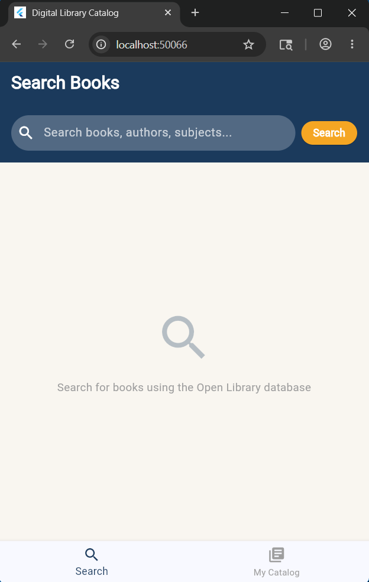
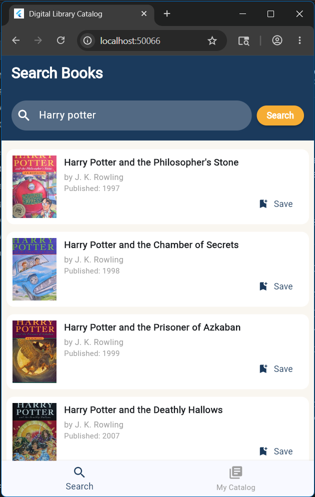
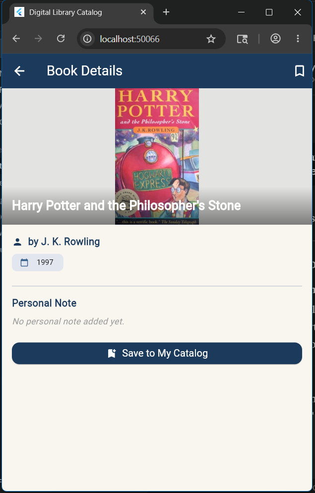
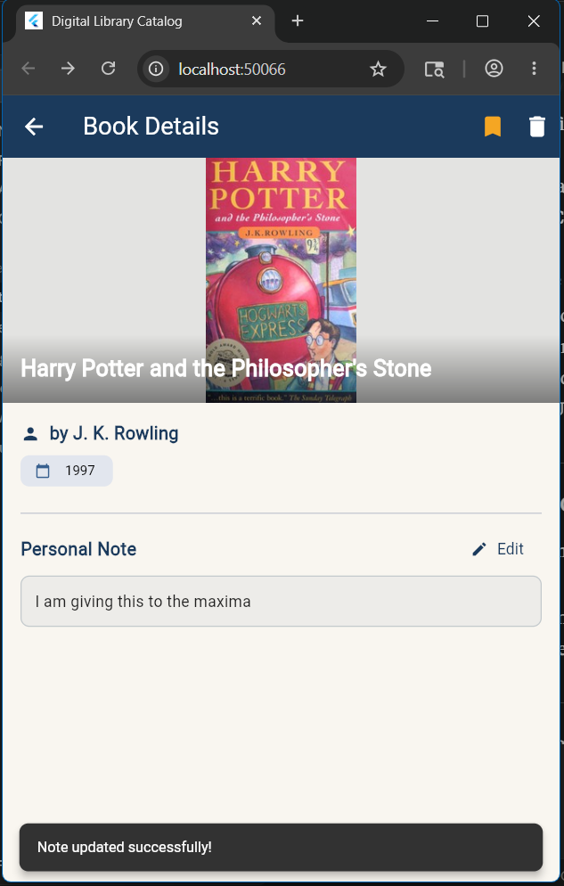
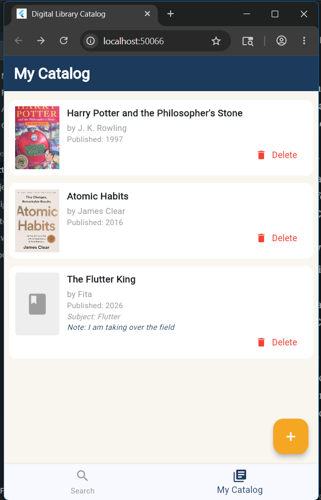
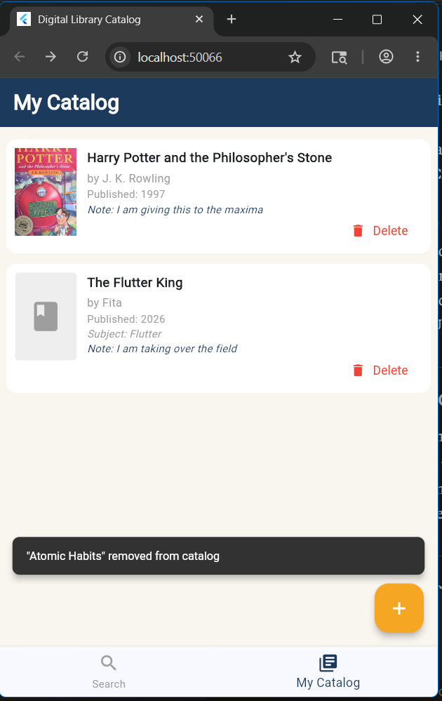
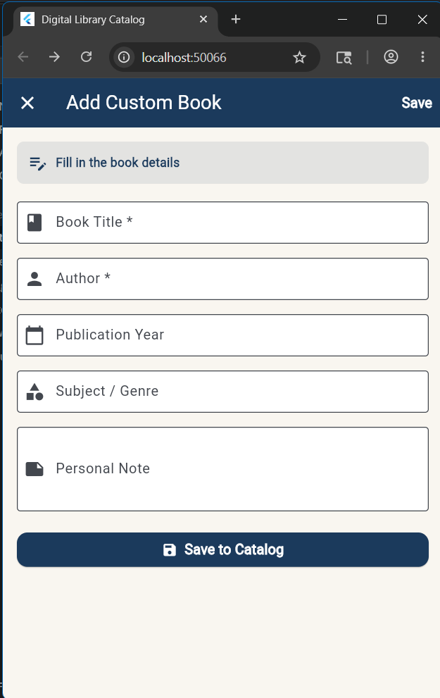

# Digital Library Catalog

A beautiful, production-ready Flutter application designed to search, browse, and curate a personal book catalog using the **Open Library API**. Built with custom, modern UI layouts, responsive user feedback, and robust state management.

## 📱 App Screenshots

Here is a visual walk-through of the application:

### 1. Search Books (Initial State)

A clean, welcoming search page ready to explore millions of books on the Open Library database.


### 2. Live Search Results

Instantaneous search results and action items to add books directly to catalog.


### 3. Detailed Book Information & Note Editing

A highly visual detail view showcasing the book cover with gradient overlays, author, release years, category tags, and editable personal notes.


_Real-time personal note updating:_


### 4. Personal Catalog Manager

A beautiful catalog hub aggregating all saved API books alongside custom-created books.


_Real-time deletion confirmation and updated catalog status:_


### 5. Add Custom Books

A validated, fully interactive form to manually insert custom books with personal reviews.


---

## Architecture & Tech Stack

The application follows clean coding patterns and solid structural architectures:

- **Framework**: [Flutter](https://flutter.dev) (Dart)
- **State Management**: `ChangeNotifierProvider` (`provider` package)
- **API Integration**: [Open Library API](https://openlibrary.org/developers/api) via custom asynchronous `ApiService`

## Getting Started

### Prerequisites

Make sure you have [Flutter SDK](https://docs.flutter.dev/get-started/install) installed on your system.

### Running the App Locally

1. Clone or navigate to the repository directory:

   ```bash
   cd digital_library_catalog
   ```

2. Fetch all package dependencies:

   ```bash
   flutter pub get
   ```

3. Launch the application on your choice of device (Desktop, Web, or Mobile Emulator):

   ```bash
   flutter run
   ```
